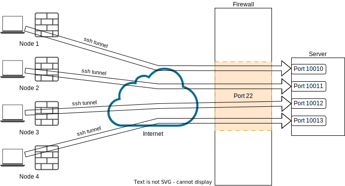

# reverse-ssh-manager

This tool helps to set up and manage a reverse ssh server.  

## Description


To access computers in other networks via ssh, a reverse ssh tunnel can be set up so that the node establishes the connection to the server. 

Through this tunnel it is possible to connect to the node via the server (ssh jump host).

## Getting Started

### Dependencies

#### server 
   * ssh 
   * python3
   * prettytable
   * sudo 

#### Node
   * ssh    
   * autossh
   * sudo 


### Installing

* clone from github
* run server_preparation.sh 
* install python3-prettytable

### Executing program

ctl.py

```
usage: ctl.py [-h] [--list] [-c CREATE] [-r REMOVE] [-a AUTOSSH]

optional arguments:
  -h, --help            show this help message and exit
  --list                List all configure Nodes
  -c CREATE, --create CREATE
                        create a new Node
  -r REMOVE, --remove REMOVE
                        remove a Node
  -a AUTOSSH, --autossh AUTOSSH
                        autossh config for Node
```
## How to uses
### Create new Node
Create a new Node with the name "ambrosia".

1. create Node. 
```bash
python3 ctl.py -c ambrosia
python3 ctl.py -a ambrosia
```
2. copy node_install/ambrosia.tar.gz to Node
   -  **or** copy the node_install/ambrosia.copy to clipboard and paste is in cmd on Node 
3. run on Node 
```
/bin/bash  client_install.sh
```
### list all nodes
```
python3 ctl.py --list
+----------+-------+--------------+------------------+
| nodename |  port |  connected   |  last connected  |
+----------+-------+--------------+------------------+
| ambrosia | 10011 | i[CONNECTED] | i[LASTCONNECTED] |
| test1    | 10012 | i[CONNECTED] | i[LASTCONNECTED] |
| test2    | 10013 | i[CONNECTED] | i[LASTCONNECTED] |
+----------+-------+--------------+------------------+
```
### Establish connection to the node

Connect to the computer "ambrosia" with the user "pi" 

#### First option
on server: 
```bash
#  ssh <node user>@localhost -p <node port>
ssh pi@localhost -p 10011
```
#### Second option

Edit ~/.ssh/config on your pc
```
Host rSSHserver
  HostName <server IP>
  User <User on server>

Host Ambrosia
  HostName localhost 
  ProxyJump rSSHserver
  Port 10011 # node port
  User pi
```


## Version History

* 0.1
    * Initial Release

## License

This project is licensed under the MIT License - see the LICENSE.md file for details
